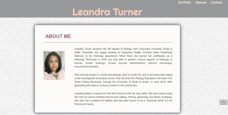

# Professional Portfolio

## **Description**
This portfolio showcases my ability to use HTML, CSS, and Bootstrap 4 to create a responsive website.
 A responsive website allows users to have an optimized browsing experience when using devices with various screen sizes such as a tablet, cellphone, desktop, etc.

This portfolio has been created while attending the Triology Education Services' Full-Stack Coding Bootcamp.

 

## **Table of Contents**

There are three (3) internal links that link to the following pages below:

1. Portfolio
    - Current bootcamp projects

2. Resume
    - pdf file

3. Contact
    - Social links
    

 

### **Preview**

 

### **Resources**
The following programs and websites were used to code the pages within this portfolio:

- [Bootstrap 4](https://www.getbootstrap.com) 

- Background: www.Unsplash.com

 

### **Badges**

