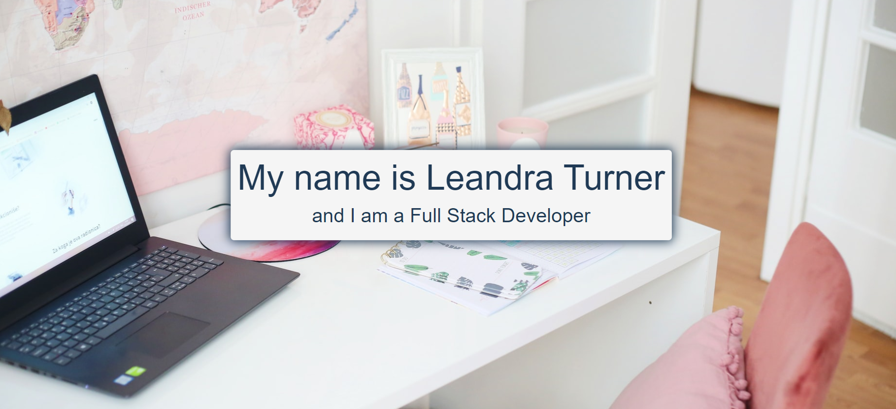

# Professional Portfolio

## INTRODUCTION

As a beginning web developer enrolled in full stack bootcamp, I want a website to allow potential employers to view my current body of work.

## DESCRIPTION

A portfolio to showcases my ability to use HTML, CSS, and Bootstrap 4 to create a responsive website.
 A responsive website allows users to have an optimized browsing experience when using devices with various screen sizes such as a tablet, cellphone, desktop, etc.

This portfolio has been created while attending the Triology Education Services' Full-Stack Coding Bootcamp.

 

## FEATURES

There are five (5) sections to visit, which are:

1. Homepage
    - Introduction to me

2. About page
    - Detailed information about my background

3. Portfolio
    - Current bootcamp projects

4. Resume
    - PDF file

5. Contact
    - From to send messages 
    

 

## PREVIEW

 

### RESOURCES
The following programs and websites were used to code the pages within this portfolio:

- [Bootstrap 4](https://www.getbootstrap.com) 

- Homepage Background: Ben Kolde on www.Unsplash.com

- Background: www.Unsplash.com

- Question Clipart: www.freepik.com

 

### BADGES

